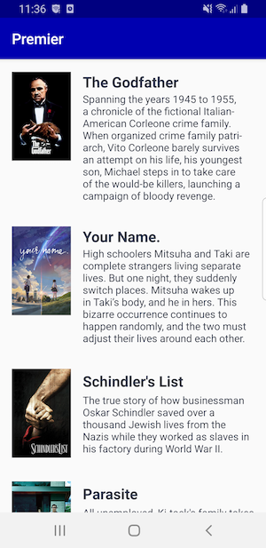
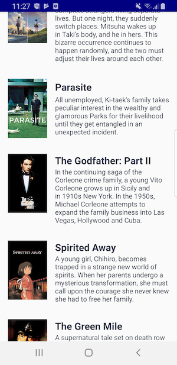
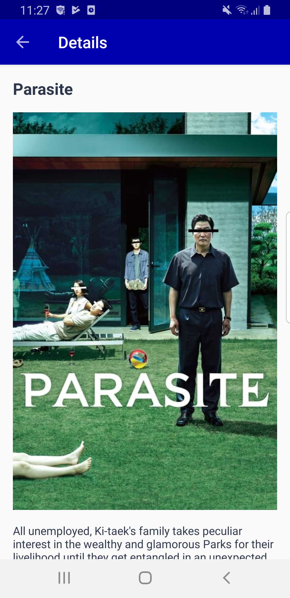
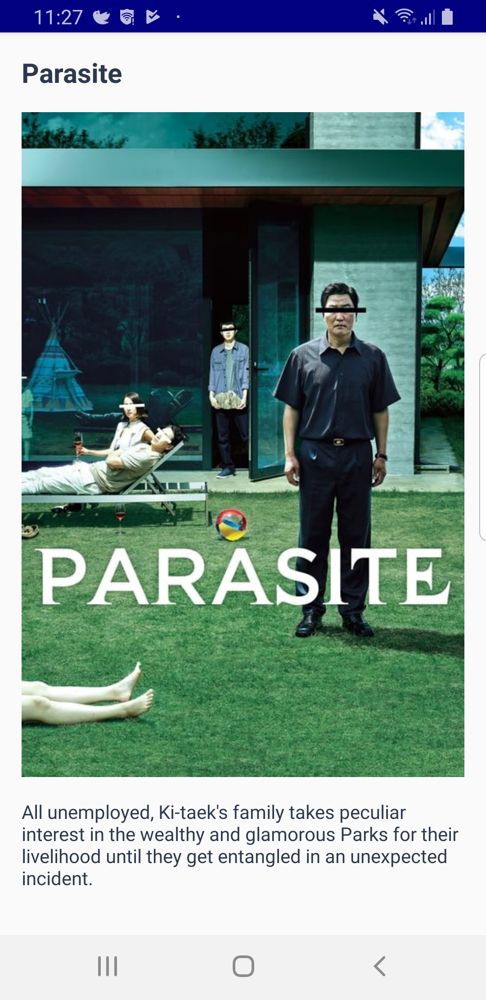

# Premier Movie

Theory without practice is empty, practice without theory is blind.

## Screenshots
&nbsp;
&nbsp;
&nbsp;

## Common Dependencies
- Kotlin, MVVM, Koin, Androidx, Architecture Components, Retrofit2, Mockk